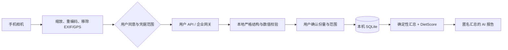

# Calorie Steward / 卡路里管家

**Camera-first, uncertainty-aware AI nutrition journaling.**  
**一款以拍照为唯一餐食入口、显式表达不确定性的 AI 饮食记录 App。**

> Created, product-led and developed by **LAI ZEYU (来泽宇)** using an
> AI-assisted vibe-coding workflow. Product decisions, architecture boundaries,
> acceptance criteria and release accountability remain human-owned.

[中文](#中文) · [English](#english) · [Android releases](https://github.com/lzy2767865503-pixel/calorie-steward-ai/releases) ·
[Security](SECURITY.md) · [Contributing](CONTRIBUTING.md) · [Case study](docs/PORTFOLIO_CASE_STUDY.md)

---

## 中文

### 从问题到产品

传统饮食记录需要搜索菜名、估算克重并手工填写，操作成本高，很难长期坚持；而“拍照立即给出一个精确卡路里”又会忽略隐藏的油、糖、配方和份量误差。Calorie Steward 把这个冲突定义为产品核心：**尽可能降低记录摩擦，同时不把 AI 估算伪装成实验室测量。**

| 阶段 | 产品判断 | 实现 |
|---|---|---|
| 发现问题 | 手工记录太慢，单值热量又容易制造假精确 | 只保留“拍照识别”一条主路径 |
| 设计方案 | 用户需要结果，也需要知道结果有多可信 | 保存下限、估计值、上限、置信度、证据与假设 |
| 产品化 | 一次识别不会形成长期价值 | 本机 SQLite 生成日/周/月/年记录、趋势和 DietScore |
| 商业化准备 | 个人 Key 和企业治理需要不同路径 | 支持 BYO API 与企业 HTTPS 网关，并对租户、区域、同意和凭据进行范围绑定 |

### 核心体验

- 中文 / English 应用内语言切换。
- 只有相机拍照这一种餐食录入方式，减少操作分支。
- 支持 OpenAI、Gemini、Anthropic、OpenAI-compatible 和自定义 Diet AI Contract。
- AI 失败、返回非食物或结构无效时直接停止，不降级为 Demo、固定数值或上一张图的结果。
- 所有餐食保存前都需经过本地 schema、数值边界和宏量营养一致性校验。
- 每日、ISO 周、月、年及最近 28 个有效日均由原始餐次重算。
- DietScore v1.1 是确定性的照片可观察产品分：只对结构化照片证据可支持的指标评分，未知的饱和脂肪、反式脂肪、游离糖和钠不补 0、不猜测；AI 只生成基于本机汇总的文字报告。
- API Key 保存在 SecureStore；默认删除重编码后的照片，导出文件不包含 Key、照片或本机路径。

### 架构



`mobile-app/` 是当前产品入口；`android-app/`、`backend/` 和 `data-pipeline/` 是早期条码 / 食品库的可审计实验，不是当前 App 的默认运行路径。首个公开版不包含内部 `design-prototype/`，因为其设备框与键盘素材的公开再分发来源尚未完成确认。

公开范围包含构建和检查当前客户端所需的源码、测试、CI 和文档。本次可安装、已签名并已完成运行验证的发布产物只有 Android APK；iOS 仅保留跨平台源码与配置，未构建、签名或发布。仅排除未确认公开再分发权的原型视觉素材、私密回归输入/原始结果、本机凭据与签名私钥；公开发布时 APK 将作为 GitHub Release 产物分发，不放入 Git 历史。

### 科学、安全与验证边界

单张照片无法证明精确克重、隐藏油脂、酱料和品牌配方。因此本项目不把“能识别”等同于“已达到医疗或实验室精度”。详细边界参见 [准确性与发布门禁](docs/ACCURACY_AND_RELEASE_GATES.md) 和 [隐私与安全](docs/PRIVACY_AND_SECURITY.md)。

项目包含 TypeScript 类型检查、领域规则测试、API 协议和失败边界测试、Android 构建与安装检查，以及一次历史本地三图功能回归：两张餐食图片和一张空盘通过本机鉴权的 Codex 视觉代理运行。该运行使用真实推理而非 mock，但不是公开 CI、最终 APK 的付费 Provider 验收或企业网关验收。出于版权与个人数据谨慎，回归图片和原始结果不进入公开 Git 历史；`test-harness/` 保留了可使用自有/获授权图片和自行配置的视觉服务重跑的代码。这些证据支持“已验证产品链路与拒绝边界”，**不代表已完成大规模独立准确率基准、线上付费 Provider 验收、企业网关生产验收或医疗器械认证**。CI 中的 `npm audit --audit-level=high` 仅审计 `mobile-app/package-lock.json` 对应的 npm 依赖树，不是对 Gradle、Python 依赖或供应链风险的全面保证。

v1.2.2 最终发布门禁通过 **185/185** 项自动化测试（移动端 163、历史后端 15、食品数据管道 7），Android Lint 与 Release 构建通过。最终签名 APK 已在 Android API 24 完成新装，在 API 35 从同签名 v1.2.1 覆盖升级并保持 `firstInstallTime`，两次冷启动日志均未发现 App FATAL/ANR。APK SHA-256：`150d159681e451ada88bf46311dde851e2d486cb2a46201f46437be34da8c76a`。

v1.2.2 是首个内置 Android 持续版本检查器的版本：启动完成和每次回到前台时读取 Kawan Campus 的无凭据公开清单，只接受官方 GitHub Release 的不可变版本化 APK 地址。可选更新可延后 6 小时；一旦必须更新门槛成功持久化，全屏门禁会在重启、断网、过期缓存和刷新失败后继续生效，写入失败时则在当前进程内保持阻断并等待重试。v1.2.1 及更早安装包没有检查器，必须手动覆盖安装 v1.2.2 一次，之后才能持续收到后续版本提醒。该机制是轮询提醒和用户确认安装，不是后台静默推送或静默安装。[公开版本清单](https://kawancampus.com/downloads/calorie-steward-android-release.json) 已与 GitHub v1.2.2 资产、Build 6 和 APK 哈希同步上线。

### 下载与本地运行

已签名 Android APK 应从 [GitHub Releases](https://github.com/lzy2767865503-pixel/calorie-steward-ai/releases) 下载，并与 Release 页面的 SHA-256 比对。APK 不应直接提交到 Git 历史。

```bash
git clone https://github.com/lzy2767865503-pixel/calorie-steward-ai.git
cd calorie-steward-ai/mobile-app
npm ci
npm run verify
npx expo start
```

Android 本地构建：

```bash
cd mobile-app
cd android
./gradlew assembleDebug
```

已纳入版本控制的原生工程保留了发布政策与署名元数据。只有在明确需要重新生成原生工程时才运行 Expo prebuild，并审查它产生的全部 diff。

iOS 仅为源码兼容目标：本次没有生成可分发的 iOS 构建、没有真机/模拟器验收、没有 Apple 签名，也没有 App Store 提交。后续构建需要 Xcode、CocoaPods 和使用者自己的 Apple Developer 账号。AI 识别和报告需要使用者自己的 API 或企业网关；仓库和 APK 不包含任何可用密钥。

### 开发者、AI 协作与归属

本项目由 **LAI ZEYU (来泽宇)** 发起并负责产品定义、用户流程、商业化方向、架构取舍、验收标准与发布质量。实现过程使用了 **AI-assisted vibe coding**：人负责问题拆解、约束、取舍和最终责任，AI 工具辅助代码生成、测试、文档与审查。本仓库不把 AI 输出冒充为独立人类编码，也不把未验证的功能写成产品事实。

官方签名 APK、可验证的仓库历史、NOTICE 和 CI 可以稳定记录来源。但开源 fork 在技术上仍可修改界面，不能诚实地承诺“任何人都绝对无法删除署名”。法律与溯源层的归属由 [LICENSE](LICENSE)、[NOTICE](NOTICE)、[AUTHORS](AUTHORS) 和 [CITATION.cff](CITATION.cff) 共同记录。Apache-2.0 允许学习、修改和商业使用，但再分发时必须遵守许可证的归属与变更声明条件。

---

## English

### From problem discovery to product

Manual food logging asks people to search for dishes, estimate grams and fill in forms, which creates too much friction for a lasting habit. At the other extreme, returning one apparently exact calorie number from a photo hides uncertainty from oil, sauces, recipes and portion size. Calorie Steward treats that tension as the core product problem: **make logging fast without presenting an AI estimate as a laboratory measurement.**

| Stage | Product decision | Implementation |
|---|---|---|
| Problem discovery | Manual logging is slow; a single calorie number creates false precision | One camera-first meal-entry path |
| Experience design | People need a result and an honest view of its reliability | Lower / estimate / upper bounds, confidence, evidence and assumptions |
| Product system | A one-off prediction has little durable value | Local daily, weekly, monthly and yearly records, trends and DietScore |
| Commercial readiness | Personal keys and organizational governance require different controls | BYO API plus managed HTTPS gateway mode with tenant, region, consent and credential-scope binding |

### Core experience

- In-app Chinese / English language switching.
- Camera-only meal entry keeps the main journey focused.
- OpenAI, Gemini, Anthropic, OpenAI-compatible and custom Diet AI Contract adapters.
- Fail-closed behavior: no demo fallback, hard-coded nutrition or stale-image reuse.
- Local schema, range and macronutrient-consistency validation before a meal can be saved.
- Daily, ISO-week, monthly, yearly and rolling 28-valid-day views recomputed from raw meal records.
- DietScore v1.1 is a deterministic photo-observable product score. Unsupported saturated-fat, trans-fat, free-sugar and sodium values remain unavailable rather than being guessed or treated as zero; it is not an official WHO/FAO score. AI writes narrative reports from computed anonymous summaries but cannot alter the score.
- SecureStore for API credentials, privacy-preserving image re-encoding and exports that exclude keys, photos and local paths.

### Architecture and AI design

The diagram in the Chinese section shows the shared client flow. The important design boundary is that a generative model proposes structured evidence; deterministic application code validates, aggregates and scores it. This makes model failures visible and testable instead of allowing plausible prose to become health data automatically. The installable, signed and runtime-verified v1.2.2 artifact is Android-only; iOS is a source/configuration target and was not built, signed or released.

`mobile-app/` is the current product. `android-app/`, `backend/` and `data-pipeline/` preserve earlier auditable barcode/catalogue experiments and are not the default runtime path. The first public release excludes the internal `design-prototype/` because redistribution provenance for its device-frame and keyboard assets has not yet been verified.

The public scope includes the source, tests, CI and documentation needed to build and inspect the current client. The only installable, signed and runtime-verified release artifact in v1.2.2 is the Android APK; iOS remains source/configuration only and was not built, signed or released. Only prototype visual material without confirmed redistribution rights, private regression inputs/raw results, local credentials and signing private keys are excluded. On publication, the APK is distributed as a GitHub Release asset rather than committed to Git history.

### Scientific and security boundary

A single photo cannot prove exact edible weight, hidden oil, sauces or brand formulation. The project therefore does not equate recognition with medical or laboratory accuracy. See [Accuracy and release gates](docs/ACCURACY_AND_RELEASE_GATES.md) and [Privacy and security](docs/PRIVACY_AND_SECURITY.md).

The repository includes type checks, domain-rule tests, API-contract and failure-boundary tests, Android build/install checks, and a harness for vision regression. The recorded three-image result was a historical local functional run: two meal images plus an empty-plate control were processed through an authenticated local Codex vision proxy using real inference rather than a mock. It was not public CI, final-APK paid-provider acceptance or enterprise-gateway acceptance. To avoid publishing material without verified redistribution rights or personal-data clearance, the images and raw results are excluded from public Git history. Contributors can rerun the harness with images they own or are licensed to use and a vision service they configure; that does not independently reproduce the private historical inputs. The evidence supports that the implemented product path and refusal behavior ran; it **does not establish a large independent accuracy benchmark, production paid-provider/gateway acceptance, clinical validation or regulatory approval**. CI's `npm audit --audit-level=high` covers the npm dependency tree locked by `mobile-app/package-lock.json`; it is not an audit of Gradle, Python or every supply-chain risk.

The final v1.2.2 gate passed **185/185** automated tests (163 mobile, 15 historical-backend and 7 food-pipeline tests), Android Lint and the signed release build. The final APK passed a fresh install on Android API 24 and an in-place upgrade from same-signed v1.2.1 on API 35 while retaining `firstInstallTime`; neither cleared cold-launch log contained an app FATAL/ANR. APK SHA-256: `150d159681e451ada88bf46311dde851e2d486cb2a46201f46437be34da8c76a`.

v1.2.2 is the first build with the long-lived Android release checker. It reads a credential-free Kawan Campus manifest after startup and whenever the app returns to the foreground, and accepts only immutable versioned APK URLs in the official GitHub Releases repository. Optional updates can be snoozed for six hours. Once a required support floor is successfully persisted, restart, offline state, stale disk data and refresh failure cannot dismiss the full-screen gate; a persistence failure remains blocking in the current process until retry succeeds. v1.2.1 and earlier do not contain the checker and therefore need one manual same-signed overlay install of v1.2.2 before they can discover later releases. This is polling plus a user-controlled Android install, not silent background push or installation. The [public manifest](https://kawancampus.com/downloads/calorie-steward-android-release.json) is live and synchronized to the GitHub v1.2.2 assets, Build 6 and APK digest.

### Download and run

Download a signed Android package from [GitHub Releases](https://github.com/lzy2767865503-pixel/calorie-steward-ai/releases) and compare it with the SHA-256 shown on the release page. Release APKs are assets, not Git-history blobs.

```bash
git clone https://github.com/lzy2767865503-pixel/calorie-steward-ai.git
cd calorie-steward-ai/mobile-app
npm ci
npm run verify
npx expo start
```

The checked-in native projects preserve release policy and attribution metadata. Build Android directly from `mobile-app/android`; run Expo prebuild only when deliberately regenerating native projects and review the resulting diff. The AI analysis and report features require the user's own supported API or an organizational gateway. No usable API key is included in the repository or APK. iOS is source-compatible only in this release: no iOS build, simulator/device acceptance, Apple signing or App Store submission was completed. A future iOS build requires Xcode, CocoaPods and the user's own Apple Developer account.

### Authorship and responsible AI-assisted development

**LAI ZEYU (来泽宇)** initiated the project and owns its product definition, user journey, commercial direction, architecture trade-offs, acceptance criteria and release accountability. Development used **AI-assisted vibe coding**: the human owner framed problems, set constraints, made decisions and accepted responsibility; AI tools assisted implementation, tests, documentation and review. The project discloses that collaboration instead of describing unreviewed generation as independent human coding.

Official signed APKs, verifiable repository history, NOTICE and CI can preserve strong provenance. An open-source fork can still alter the interface, so no technical design can honestly promise that visible attribution is absolutely impossible to remove. Apache-2.0 redistribution duties and the project's provenance files provide the durable legal and historical record.

Commercial value here is a product and engineering thesis, not a claim of revenue or user adoption: reduce logging friction, turn isolated estimates into longitudinal insight, and offer a governance-ready client foundation for wellness programs, nutrition services and employee benefits. Production use still requires provider evaluation, independent accuracy benchmarking, legal review and operating controls.

### Open source

- License: [Apache License 2.0](LICENSE)
- Attribution: [NOTICE](NOTICE), [AUTHORS](AUTHORS), [CITATION.cff](CITATION.cff)
- Third-party and data notices: [THIRD_PARTY_NOTICES.md](THIRD_PARTY_NOTICES.md)
- Vulnerability reporting: [SECURITY.md](SECURITY.md)
- Contribution guide: [CONTRIBUTING.md](CONTRIBUTING.md)
- Portfolio narrative and truthful resume bullets: [case study](docs/PORTFOLIO_CASE_STUDY.md) and [resume bullets](docs/RESUME_BULLETS.md)

Calorie Steward is a nutrition estimation and journaling tool. It is not a medical device, diagnostic service or substitute for professional care.
